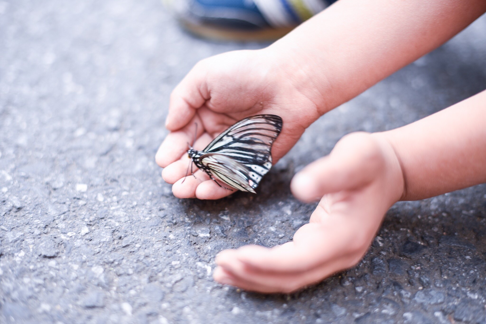

# Our Mission

**Our mission is to create a school that values caring relationships based on trust, and makes heard the voices of children in all aspects of their education.** Kaleide International School is a home-like setting where children will find continuity between their family, their school and the wider society; a growth-mindset-friendly community where children feel safe from judgement, respected in their own rhythms, and supported in their full potential; a learning environment which inspires wonder, curiosity, research, experimentation, problem-solving, creativity, and collaboration. We foster children's self-motivation and autonomy, together with critical and divergent thinking, emotional awareness and competence, while nurturing their inner sense of belonging and connectedness to nature.

**We entrust children with freedom to make decisions in a way that allows them to be lifelong learners, and responsible, thoughtful human beings who understand the complexity of the world around them, and have the knowledge, values, attitudes and skills to make a positive contribution.**

