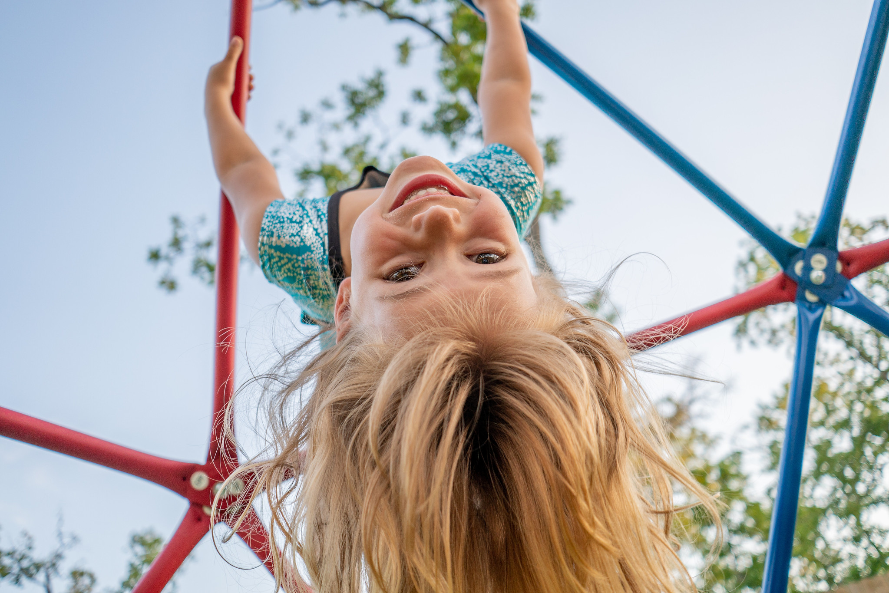

# Our View of Children

Within our approach, **each child is valued as a subject of rights and a competent, curious, active learner, continuously co-creating and testing theories about herself and the world around her**. 

We believe children are wonderfully prepared for active learning from birth; they are self-driven and intrinsically motivated to learn at every step. For them the world is an invitation to discover. This image of the child shapes our expectations of children, and the degree of freedom and responsibility we trust them with.

