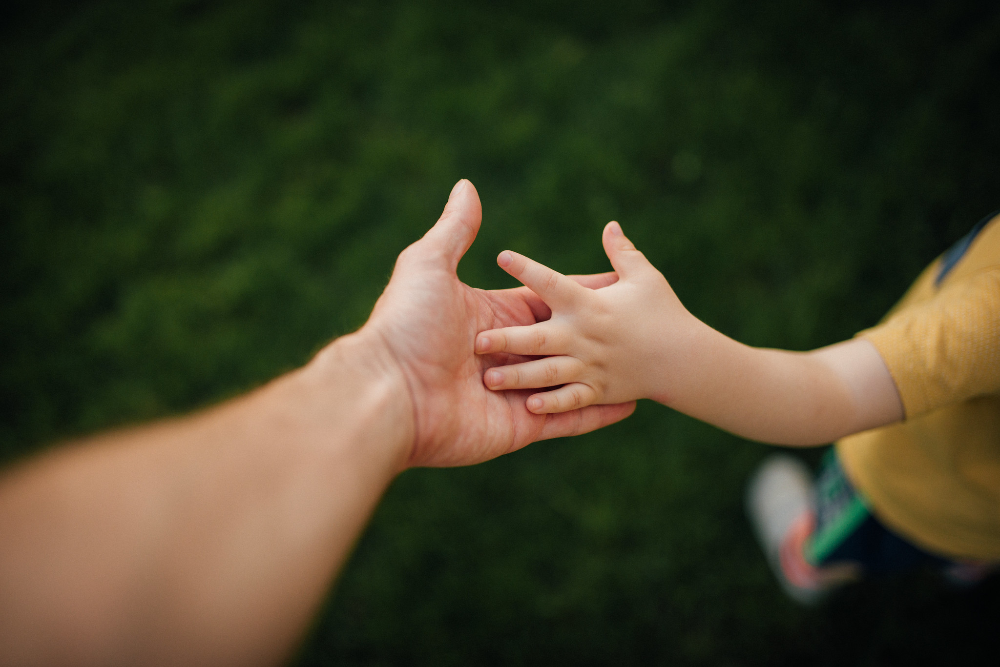
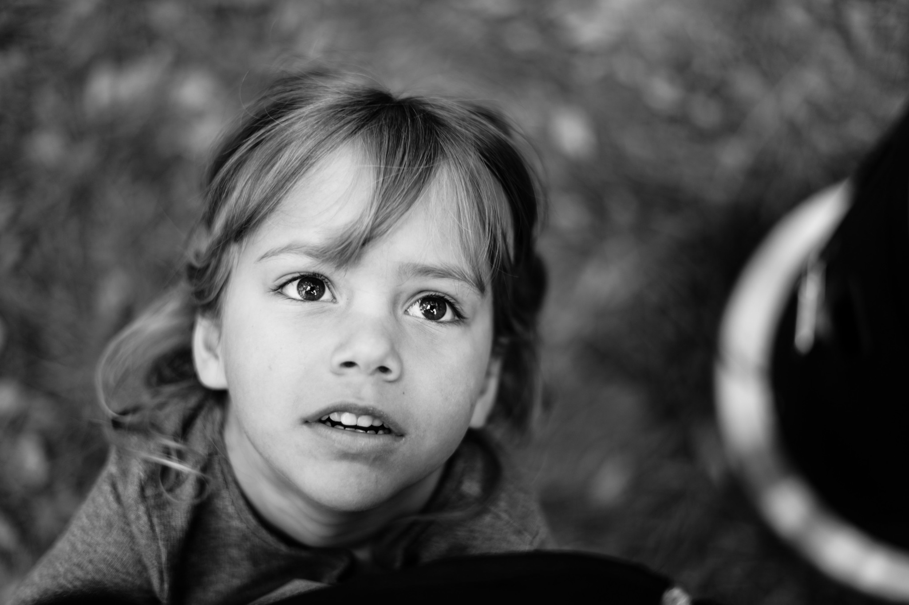

# Our View of Learning

### Our View of Learning

Essential to our approach is the understanding that **children learn through play and through diverse interactions with adults, other children and the environment. They learn through their curiosity**, and by attending to those things which spark their interest and their motivation. They learn **through observation, imitation, trial and error, and reflection. They learn with their minds, but also through all their senses and with their whole bodies**. They learn in conscious, deliberate, ways, and in ways which escape volition –but are nonetheless powerful. **They learn from our words, but more importantly, from our actions.**

**Learning is not a linear process**: it is complex, with stops and starts along the way, ‟a gradual ebbing and flowing of the frequencies of alternative ways of thinking”, in the words of Professor Robert Siegler. A child doesn't learn skills and concepts just once –he or she relearns them at successively more mature levels.

We believe children learn best through active participation and experience. **When they are allowed and encouraged to follow an interest and construct a plan to learn about it, their intrinsic motivation propels them.** Children learn in an integrated, creative and play-based way when the environment is rich in relationships, resources, materials, inspiration, language and support. But this is true only if children feel safe, trusted, and have the possibility to listen and be listened to, to express their differences and be receptive to the differences of others. **Learning should be authentic, and not done to please others or in response to coercion.**

**Our approach recognises the centrality of the relationships that children have with their parents, and the teachers \(or “facilitators”\) in the school.** We believe family and community links should be strengthened and nurtured. At Kaleide International School, parents are encouraged to be a part of their children's learning. Learning, as an integral and enjoyable part of life, should be modelled by the adults at the school: facilitators, parents and visitors. **But learning is not only based on interaction between adults and children: it is also built upon what children learn from each other.**

**We acknowledge that Education can happen throughout the school and that the classroom is only one of the many environments that offers the opportunity to learn.** For this reason, every learning environment in the school is designed from a multiple-intelligences perspective, in order to promote a wide range of challenges, interactions, and self-motivated, hands-on experiential learning with real-world connection. We believe the potential for learning is maximised if we use the powerful combination of physical, visual and naturalistic ways of learning as well as our linguistic and mathematical intelligence. Integrating all these forms of cognition is crucial to engage children in meaningful, deep-level learning. 

**Our approach allows children's curiosity and intrinsic motivation to flourish, and values autonomy as the key to active learning through exploration, discovery and creation.**

