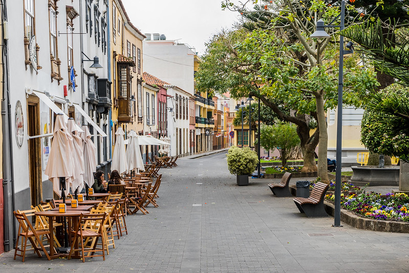

# Nuestra ubicación

**Kaleide International School cuenta con instalaciones propias y 2500 m2 de zonas verdes, ubicadas en un tranquilo barrio residencial de la hermosa ciudad de San Cristóbal de La Laguna, en el norte de la isla de Tenerife.** En 1999, la UNESCO declaró Patrimonio de la Humanidad el centro histórico de la ciudad. La Laguna es la segunda ciudad más poblada de Tenerife tras Santa Cruz, la capital, que se encuentra a solo 15 kilómetros. Ambas ciudades están conectadas por autopista y por transporte público directo.

Estamos solo a 10 minutos a pie del casco histórico de la ciudad, y muy cerca de recursos valiosos como el Museo de Historia y Antropología, la biblioteca municipal, y el Museo de la Ciencia y el Cosmos. A muy poca distancia contamos con instalaciones deportivas públicas donde practicar atletismo, tenis y fútbol \(Estadio Francisco Peraza\), una piscina pública \(Complejo Deportivo San Benito\), así como con un parque público \(Parque de la Vega\) con un rocódromo, una pista de skate, canchas de baloncesto, mesas de ping-pong y una pista de motocross. La escuela se encuentra también muy cerca de la Mesa Mota, una montaña de cima plana en la que pervive un bosque de laurisilva bien preservado.



A poca distancia a pie desde la escuela hay un aparcamiento público gratuito, y es posible aparcar en las calles adyacentes.

Tanto el clima suave subtropical \(con media de 12–19 °C en invierno y de 17–24 °C en verano\) como el maravilloso entorno natural nos ofrecen valiosas oportunidades de disfrutar actividades al aire libre todo el año.

