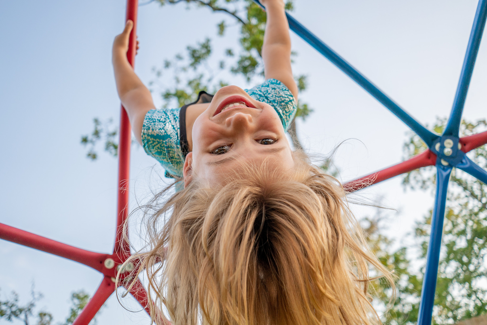

# Nuestra visión de la infancia

**Dentro de nuestro enfoque, cada niño y niña es valorado como sujeto de derechos, y como una persona curiosa y activa capaz de aprender y de explorar todo lo que le rodea, de co-crear y poner a prueba nuevas hipótesis sobre sí misma y sobre el mundo.** 

Creemos que los niños y niñas vienen preparados para el aprendizaje activo desde el nacimiento; rebosan motivación intrínseca y ganas de aprender a cada paso. El mundo les invita a descubrirlo. 

Vemos a los niños y niñas como personas competentes que merecen nuestra confianza, de ahí el grado de libertad y de responsabilidad que les confiamos.

