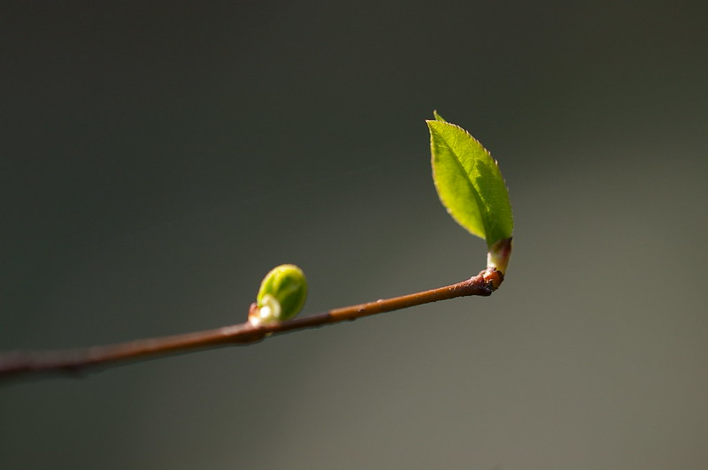

# Nuestra visión

Queremos seguir abordando la educación desde una perspectiva innovadora y atrevida, e inspirar a otras escuelas, educadores y familias. Seremos una escuela que mejore sus prácticas a través de la observación y la reflexión, de procesos iterativos que impliquen a las familias, los educadores, y los niños y niñas, así como la investigación científica.

Nuestra visión está alineada con transformaciones profundas a nivel social, económico y medioambiental –tales como el software libre, la cultura abierta y la democratización del conocimiento– que están trastocando nuestra forma de ver la educación, y que dan forma a nuestros valores:

La investigación, el razonamiento y el pensamiento crítico se han convertido en herramientas indispensables para navegar la Era de la Información, y deberían apuntalar **nuestra visión del aprendizaje como un proceso apasionante, conectado con lo sensorial y regido por ritmos individualizados.**

Habilidades como **la inteligencia emocional, la comunicación y la colaboración** no solo son indispensables en una economía colaborativa, sino que **deben también contribuir a una visión más democrática y humana de la educación que valore la iniciativa, la responsabilidad activa y el compromiso social.**

Un entorno cada vez más tecnológico puede contribuir al aprendizaje, pero **debemos reconocer y priorizar la naturaleza y los espacios abiertos como el principal espacio de aprendizaje por su capacidad de promover la confianza, la resiliencia y la salud física y emocional de los niños y niñas.** Por añadidura, sin una conexión profunda con la naturaleza, los jóvenes no podrán –ni querrán– protegerla.

Por medio de nuestro compromiso con estos valores, y fortaleciendo nuestras conexiones con colectivos, organizaciones y personas implicados en temas educativos, sociales y medioambientales, **Kaleide International School tiene el propósito de contribuir a un cambio positivo en las vidas de los niños y niñas, de sus familias, así como en la comunidad circundante y el entorno natural.**

