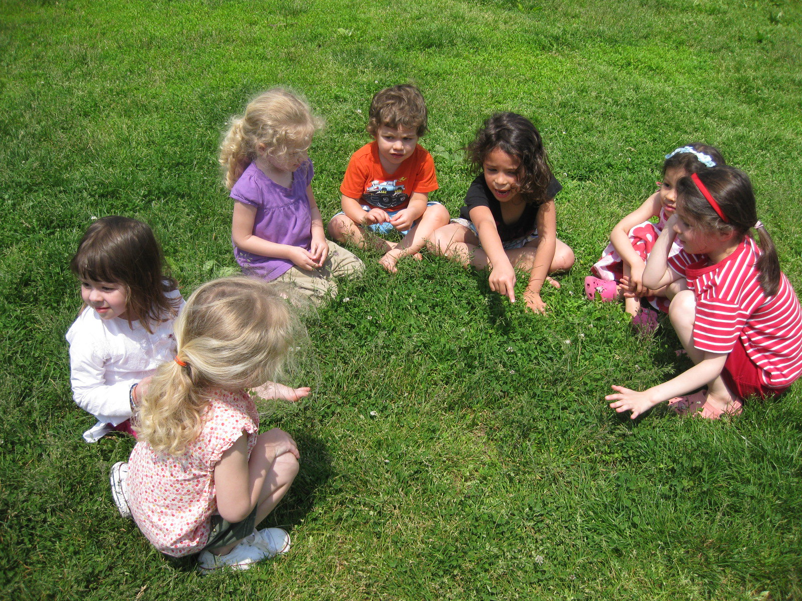

# Nuestro enfoque pedagógico

**Creemos que cualquier enfoque pedagógico debe inspirar la forma en que los niños y niñas aprenden y cómo se desarrollan como seres sociales.** Debe responder a las necesidades sociales, emocionales e individuales de los niños y niñas, y ha de ser suficientemente flexible para permitir a los estudiantes avanzar a un ritmo y de una manera que salvaguarde su curiosidad innata y su sentimiento de asombro, que son imprescindibles para seguir aprendiendo toda la vida.

Como educadores, nuestro objetivo es dar a los y las estudiantes la oportunidad de aprender de forma significativa, con un propósito auténtico, y alentar un aprendizaje basado en la exploración y el descubrimiento en contextos orgánicos. 

**El cuidado y la educación constituyen una unidad en nuestro enfoque, ya que entendemos que la educación se basa en interacciones basadas en el cuidado, entre niños/as y entre niños/as y adultos.** 

En Kaleide queremos que estos vínculos de cuidado abarquen el mundo de las ideas, el mundo humano y el mundo natural. Queremos alentar a los niños y niñas a que exploren ideas acerca de sí mismos y del mundo en el que viven; a que se hagan preguntas y se den cuenta de que necesitamos encontrar las respuestas por nosotras mismas; a acoger la diversidad y la ambigüedad; a adquirir un sentido de responsabilidad hacia sí mismos y hacia las demás personas; a crear y dar significado a sus vidas y, en palabras de la educadora Maxine Greene, "**contemplar lo cotidiano con ojos nuevos**".

